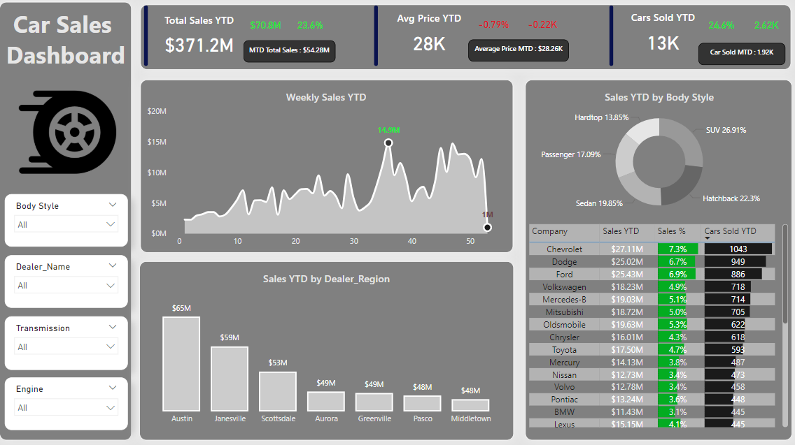

# Car Sales Analysis Dashboard

## Overview
The "Car Sales Analysis Dashboard" is a comprehensive analytical tool built using Power BI to provide valuable insights into car sales data. This project helps businesses, analysts, and stakeholders understand sales trends, identify high-performing regions, and make data-driven decisions. The dashboard focuses on year-to-date (YTD) metrics, comparisons, and visual representations to enhance data interpretation.

## Features
- **Total Sales YTD**: Aggregate sales year-to-date.
- **Weekly Trends**: Line chart depicting weekly sales performance.
- **Regional Insights**: Bar chart comparing sales across dealer regions.
- **Body Style Distribution**: Pie chart showing the proportion of sales by car body style.
- **Dynamic Filters**: Interactive filters for body style, dealer, transmission, and engine type.
- **Comparative Metrics**: Monthly and yearly changes in sales and average prices.

## Preview


The above image is a snapshot of the completed dashboard, showcasing key metrics and visualizations.


## DAX Calculations
The following DAX calculations were implemented to create key metrics:

### Cars Sold YTD
Calculates the total number of cars sold year-to-date.
```DAX
Cars Sold YTD = TOTALYTD(COUNT(car_data[Car_id]), 'Calendar'[Date])
```

### Car Sold Diff
Shows the difference in cars sold compared to the same period last year.
```DAX
Car Sold Diff = 
VAR Cars_Sold_LY = CALCULATE(COUNT(car_data[Car_id]), SAMEPERIODLASTYEAR(calendar[date]))
VAR diff = [Cars Sold YTD] - Cars_Sold_LY
RETURN diff
```

### Average Price MTD
Displays the average car price for the month-to-date with a formatted text output.
```DAX
Average Price MTD = 
VAR total_average = TOTALMTD(AVERAGE(car_data[Price ($)]), calendar[date])
VAR texts = CONCATENATE("Average Price MTD : ", FORMAT(total_average / 1000, "$0.00K"))
RETURN texts
```

### Average Price YoY
Compares the average price year-over-year.
```DAX
Average Price YoY = 
[Average Price Diff] / CALCULATE(AVERAGE(car_data[Price ($)]), SAMEPERIODLASTYEAR(calendar[date]))
```

## Files in the Repository
- **Car Sales.xlsx**: The dataset containing raw car sales data.
- **Car Sales Report.pbix**: The Power BI file for the dashboard.
- **CarDashboard.png**: A screenshot of the final dashboard for preview purposes.

## Contact
For any inquiries, feel free to reach out:
- **Name**: Bahaa Medhat Wanas
- **Email**: bahaawanas427@gmail.com
- **LinkedIn**: [Bahaa Wanas](https://www.linkedin.com/in/bahaa-wanas-9797b923a)

---
